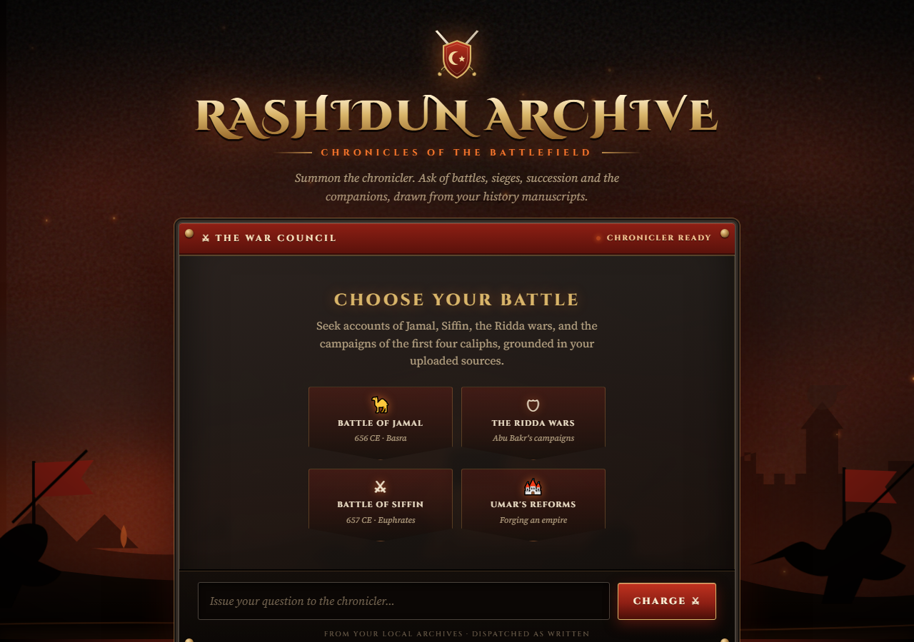

# ⚔ Rashidun Archive: Islamic History RAG System

A Retrieval-Augmented Generation (RAG) chatbot that answers questions about the **Rashidun Caliphate**: Abu Bakr, Umar, Uthman and Ali (may Allah be pleased with them). Every answer is grounded in your own PDF manuscripts and cites the source file and page.

It ships with a battlefield-themed web interface and streams answers token by token.



## Features

- **Grounded answers**: the model answers only from retrieved passages and says so when the context is insufficient.
- **Source citations**: each answer lists the PDF and page numbers it drew from.
- **Streaming UI**: answers are streamed live over Server-Sent Events.
- **Battlefield theme**: burning sky, cavalry, arrow volleys, war banners and parchment dispatches.
- **LangGraph pipeline**: a simple `retrieve → generate` graph built with LangChain.

## Tech stack

| Layer        | Technology                                                  |
|--------------|-------------------------------------------------------------|
| LLM          | Google Gemini (`gemini-3.1-flash-lite`)                     |
| Embeddings   | Gemini `gemini-embedding-001` (768 dims)                    |
| Vector store | [Qdrant](https://qdrant.tech/)                              |
| Orchestration| LangChain + LangGraph                                       |
| Backend      | FastAPI + Uvicorn                                           |
| Frontend     | Single-file HTML/CSS/JS (`static/index.html`)               |

## Project structure

```
islamic-history-rag/
├── app.py            # FastAPI server: UI + /api/ask and /api/ask/stream
├── rag.py            # RAG pipeline (retriever, prompt, LLM, streaming)
├── ingest.py         # Loads PDFs, chunks them, embeds and indexes into Qdrant
├── data/pdfs/        # Source manuscripts (PDF)
├── static/index.html # Battlefield-themed chat UI
├── requirements.txt
└── .env.example      # Template for environment variables
```

## Getting started

### 1. Prerequisites

- Python 3.11+
- A [Gemini API key](https://aistudio.google.com/apikey)
- A running Qdrant instance. The quickest way is Docker:

```bash
docker run -p 6333:6333 -v qdrant_storage:/qdrant/storage qdrant/qdrant
```

### 2. Install

```bash
git clone https://github.com/<your-username>/islamic-history-RAG-system.git
cd islamic-history-RAG-system

python -m venv .venv
# Windows
.venv\Scripts\activate
# macOS / Linux
source .venv/bin/activate

pip install -r requirements.txt
```

### 3. Configure

Copy the example env file and fill in your values:

```bash
cp .env.example .env
```

| Variable            | Description                                  |
|---------------------|----------------------------------------------|
| `GEMINI_API_KEY`    | Your Google Gemini API key                   |
| `QDRANT_URL`        | Qdrant URL, e.g. `http://localhost:6333`     |
| `QDRANT_COLLECTION` | Collection name (default `islamic_history`)  |

> `.env` is git-ignored. Never commit your real keys.

### 4. Ingest the manuscripts

Put your PDFs in `data/pdfs/`, then run:

```bash
python ingest.py
```

This splits the PDFs into 800-character chunks with 150 characters of overlap, embeds them with Gemini and (re)creates the Qdrant collection.

### 5. Run the app

```bash
python -m uvicorn app:app --reload --port 8000
```

Open **http://localhost:8000** and ask your question.

## API

| Method | Endpoint           | Description                                    |
|--------|--------------------|------------------------------------------------|
| GET    | `/`                | Web UI                                         |
| POST   | `/api/ask`         | Returns `{ answer, sources }` as JSON          |
| POST   | `/api/ask/stream`  | SSE stream of `status`, `token`, `sources`, `done` events |

Example:

```bash
curl -X POST http://localhost:8000/api/ask \
  -H "Content-Type: application/json" \
  -d '{"question": "What happened at the Battle of Jamal?"}'
```

## Example questions

- What happened at the Battle of Jamal?
- What happened during the Ridda wars under Abu Bakr?
- What reforms did Umar introduce?
- How was Uthman chosen as caliph?

## Disclaimer

Answers are generated by an AI model from the supplied documents. They may be incomplete or imprecise. For religious or scholarly matters, please verify with authentic sources and qualified scholars.
